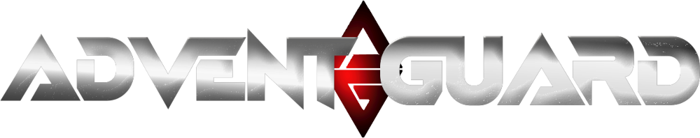

# Overview
Currently in development: 

## Quick Links
- [Attachments](Advent Guard/attachments.md)
- [UE5 Troubleshooting](troubleshooting/UE5.troubleshooting.md)

## What is the Advent Guard?
Legion of AI driven machines deployed on remote worlds to study, defend and prepare for the arrival of humans.

## What game are you making?

I'm not sure what genre the concept behind Advent Guard neatly fits into; it might be best to start with the four inspirations behind the project: 

***Mechwarrior*** (Most of them)
The obvious and low hanging fruit of all the list - Mechwarrior excelled at giving players very technical control over their mechs and that level of control over our exoskeletons is no different and a driving force behind this project. Numbers matter and feeling like you are really in control of tuning your loadout matters. 

***One Must Fall 2097***
THE Robot battler of the *PC Gamer* demo disk era. Forget *Street Fighter* and *Mortal Kombat*! So many LAN parties started and ended with that amazing synthetic theme song. Egos were bruised and cries could be heard for miles, and we skill talk about our childhood tournaments to this day. A lot of good robotic/mech fighting and arena games have come out since, but the credit for inspiration needs to go to our original inspiration! Advent Guard hopes to capture the intense heavy metal combat and the good feeling gameplay and pure excitement that OMF2097 delivered through fast and weighty gameplay with a large focus on sound effects that put you in the middle of that wonderful crunching metal.

***Star Wars Galaxies***
To this day still one of the most innovative and meaningful crafting systems in any game (prior to NGE anyway..). With the dynamic planetary resource spawns and other economic features like player associations, player stores and vendors, this game was a crafters dream. I, myself, played as a Weaponsmith on the Kettemoor server and have been searching for a similar experience in the years since to fill the void left by this gem. Advent Guard aims to have every attachment be a truly unique item that stems from a complex resource statistic driven crafting system.

***Eve Online***
Known everywhere for its fully player driven economy and massive headline gaining battles - which is an inspiration in itself. However what always inspired us the most about Eve Online is how CCP found an interesting way to handle ship loadouts to expand just beyond normal "slots" and allowed players to build complex loadouts for various purposes to work together. Player could have the same ship but play it hundreds of different ways based on the loadout they used. Playing for years, I always thought "This would be so cool if there was a game that handles robots the same way!" Advent Guard is that game.

This repo and wiki will serve as the public facing documentation for the project so please feel free to comment, suggest and participate here or on our social media!

Keep tabs on the Dev Stream over at [CarbyneGames.com](https://carbynegames.com) and help us bring this to life!

Please follow our other socials to help support and keep tabs on the project!
- [Twitter: twitter.com/CarbyneGames](https://twitter.com/CarbyneGames)
- [TikTok: tiktok.com/@carbyne.games](https://tiktok.com/@carbyne.games)
- [Insta: instagram.com/carbyne.games](https://instagram.com/carbyne.games)
- [Discord: discord.gg/6skRnvGxfV](https://discord.gg/6skRnvGxfV)
- [Patreon: patreon.com/carbynegames](https://patreon.com/carbynegames)
- [Linktree: linktr.ee/CarbyneGames](https://linktr.ee/CarbyneGames)
- [Web: carbynegames.com](https://carbynegames.com)